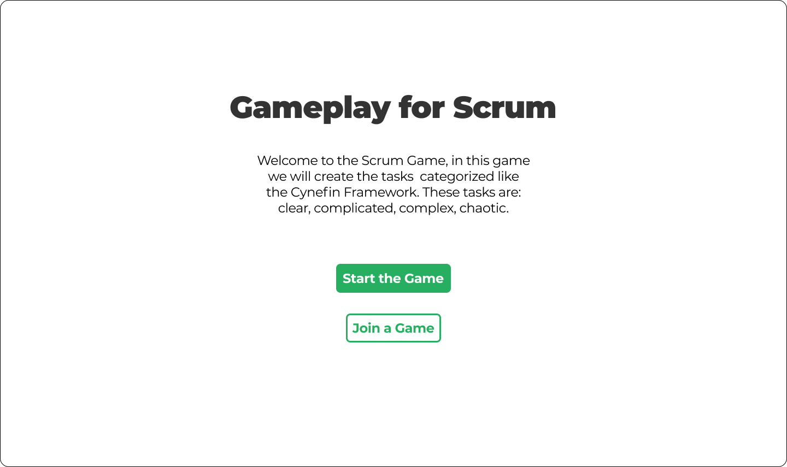

# Gameplay for Scrum

A learning game that teaches Agile and Scrum basics through an interactive, multiplayer web application. Players manage tasks across Product Backlog, Sprint Backlog, In Progress and Done areas to experience Scrum concepts hands-on.

Developers:
- Evren Çetinkaya
- Deniz Büyüktaş
- Mustafa Eren Şentürk
- Yusuf Hilmi Hacıyusufoğulları

## Video Demo
Please click on the image below to reach our demo video!
[](https://youtu.be/t8udjmgmowc)

## Key features
- Real-time multiplayer synchronization using WebSockets (Socket.IO).
- Task types mapped to the Cynefin Framework: clear, complicated, complex.
- In-game token system to simulate team effort.
- Retrospective chat for team communication.
- Simple tutorial to onboard new players.

## Important files & symbols
- Server entry: [`backend/server.js`](backend/server.js)  
- Backend package config: [`backend/package.json`](backend/package.json)  
- Frontend package config: [`frontend/package.json`](frontend/package.json)  
- Frontend app entry: [`frontend/src/App.js`](frontend/src/App.js)  
- Frontend socket client: [`frontend/src/socket.js`](frontend/src/socket.js)  
- Context providers:
  - [`TaskProvider`](frontend/src/contexts/task_context.js)
  - [`SprintProvider`](frontend/src/contexts/sprint_context.js)
  - [`ProgressContext` / `ProgressProvider`](frontend/src/contexts/in_progress_context.js)
  - [`DoneProvider`](frontend/src/contexts/done_context.js)
  - [`PlayersProvider`](frontend/src/contexts/players_context.js)
- Key React components:
  - [`ProductBacklog`](frontend/src/components/ProductBacklog.js)
  - [`GameBoard`](frontend/src/components/GameBoard.js)
  - [`RetroNotes`](frontend/src/components/RetroNotes.js)
  - [`EnterName`](frontend/src/components/EnterName.js)
  - [`Players`](frontend/src/components/Players.js)
  - [`Player`](frontend/src/components/Player.js)
  - Tutorial: [`frontend/src/Tutorial.js`](frontend/src/Tutorial.js)
- Frontend styles and icons: [`frontend/src/App.css`](frontend/src/App.css) and [`frontend/src/components/icons/icons.css`](frontend/src/components/icons/icons.css)

## Quick start (development)

1. Start backend
```sh
cd backend
npm install
npm start
```
The backend uses Socket.IO and listens on the port defined by `process.env.PORT` or 4000. See [`backend/server.js`](backend/server.js).

2. Start frontend
```sh
cd frontend
npm install
npm start
```
The frontend runs on http://localhost:3000 by default. See [`frontend/package.json`](frontend/package.json) and [`frontend/src/App.js`](frontend/src/App.js).

## How the game works (short)
- Enter your display name via the [`EnterName`](frontend/src/components/EnterName.js) form.
- The server seeds tasks into Product Backlog (retrieved by [`TaskProvider`](frontend/src/contexts/task_context.js) via the generate endpoint in [`backend/server.js`](backend/server.js)).
- Click a backlog task to move it to Sprint Backlog (`task-sprint`) — handled in components such as [`ProductBacklog`](frontend/src/components/ProductBacklog.js) and icon components (`frontend/src/components/icons/*`).
- From Sprint Backlog, click to move tasks to In Progress (`task-progress`); players spend tokens in the In Progress phase (see [`Player`](frontend/src/components/Player.js) and token events in [`frontend/src/components/icons/*`]).
- When tasks are completed they are moved to Done (`task-done`).
- Use the Retrospective panel (`RetroNotes` — [`frontend/src/components/RetroNotes.js`](frontend/src/components/RetroNotes.js)) for team chat.

## Development notes
- Real-time socket events used across the app (see [`backend/server.js`](backend/server.js)):
  - chat, token, task-backlog, task-sprint, task-progress, task-done, user
- Contexts listen and dispatch based on these socket events. Example providers:
  - [`frontend/src/contexts/task_context.js`](frontend/src/contexts/task_context.js)
  - [`frontend/src/contexts/sprint_context.js`](frontend/src/contexts/sprint_context.js)
  - [`frontend/src/contexts/in_progress_context.js`](frontend/src/contexts/in_progress_context.js)
  - [`frontend/src/contexts/done_context.js`](frontend/src/contexts/done_context.js)
  - [`frontend/src/contexts/players_context.js`](frontend/src/contexts/players_context.js)

## Contributing
- Add or edit tasks in the MongoDB collection referenced by [`backend/server.js`](backend/server.js).
- Improve UI or add features in frontend components under [`frontend/src/components/`](frontend/src/components/).
- Open pull requests and include clear descriptions and screenshots / steps to reproduce.

## License
No license file included. Add a LICENSE if you want to open-source the project.
